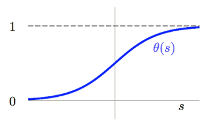
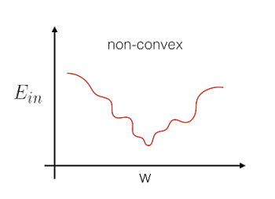
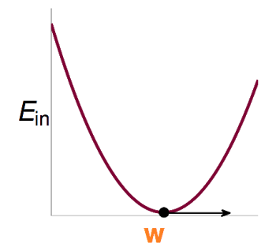
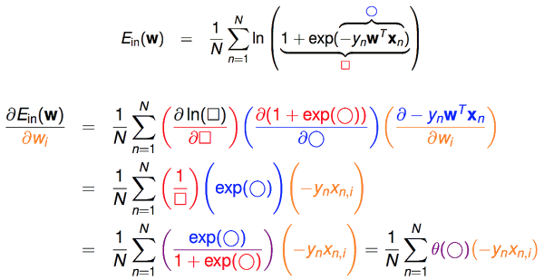
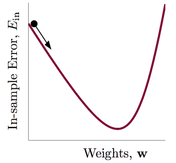
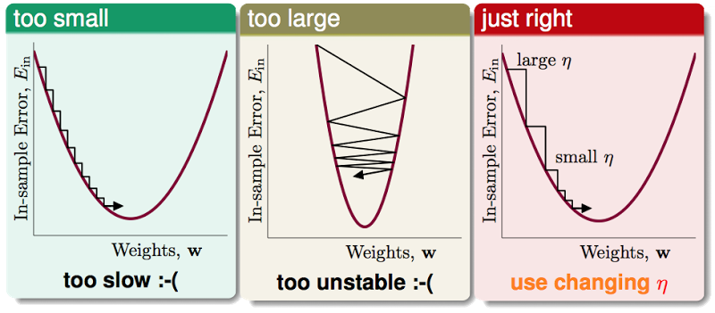

&emsp;&emsp;[上一篇](http://beader.me/2014/03/09/linear-regression/)比较深入地去理解了线性回归的思想和算法。分类和回归是机器学习中很重要的两大内容。而本篇要讲的Logistic Regression，名字上看是回归，但实际上却又和分类有关。

&emsp;&emsp;之前提过的二元分类器如PLA，其目标函数为， $$f(x)=sign(w^Tx)\in\{-1,+1\}$$，输出要么是-1要么是+1，是一个“硬”的分类器。而Logistic Regression是一个“软”的分类器，它的输出是$$y=+1$$的概率，因此Logistic Regression的目标函数是 $$\color{purple}{f}(x)=\color{orange}{P(+1|x)}\in [0,1]$$。

## 方程的形式

$$
h(x)=\frac{1}{1+exp(-w^Tx)}
$$

&emsp;&emsp;上面的方程背后有什么逻辑呢？

&emsp;&emsp;假设医院知道一个病人的年龄、性别、血压、胆固醇水平，可以为他计算他得某种病的概率。最简单的做法就是对这几个特征进行加权求和：

$$
\color{purple}{s}=\sum_{i=\color{red}{0}}^d\color{orange}{w_i}{x_i}=w^Tx
$$

&emsp;&emsp;但这里有个问题，就是 $$\color{purple}{s}$$ 的取值范围是$$[-\infty,+\infty]$$，而我们希望输出的是对该病人患病概率的一个估计，就需要把输出空间$$[-\infty,+\infty]$$转换到$$[0,1]$$上。如何变换？通过sigmoid函数 $$\color{blue}{\theta}$$ 。

$$
\color{blue}{\theta}(\color{purple}{s})=\frac{e^\color{purple}{s}}{1+e^\color{purple}{s}}=\frac{1}{1+e^\color{purple}{-s}}
$$

&emsp;&emsp;因此，我们就可以利用经过sigmoid变换后的方程来对患病概率进行一个估计。

## 误差的衡量 - Cross Entropy Error

&emsp;&emsp;有了方程的形式，我们就需要一个误差的衡量方式。[上一篇](http://beader.me/2014/03/09/linear-regression/)我们讲到Linear Regression所使用的是平方误差，那么Logistic 可以使用平方误差吗？当然可以，error是人定的，你爱怎么定就怎么定，但是使用平方误差好不好，不好。为什么呢？

&emsp;&emsp;如果使用平方误差，每个点产生的误差是：

$$
\begin{aligned}
err(h,x_n,y_n) &=
\left\{
\begin{matrix}
(\color{blue}{\theta}(w^Tx)-0)^2 & y_n=0 \\\
(1-\color{blue}{\theta}(w^Tx))^2 & y_n=1
\end{matrix}\right. \\\
&=y_n(1-\color{blue}{\theta}(w^Tx))^2+(1-y_n)\color{blue}{\theta}^2(w^Tx)
\end{aligned}
$$

&emsp;&emsp;此时cost function，$$E_{in}(w)=\sum{err}$$就是一个关于$$w$$的非凸函数(non-convex)：

&emsp;&emsp;非凸函数由于存在很多个局部最小点，因此很难去做最优化(解全局最小)。所以Logistic Regression没有使用平方误差来定义error，而是使用极大似然法来估计模型的参数。那么我们就要先来了解一下这个似然性(likelihood)。

&emsp;&emsp;Logistic Regression的目标函数的输出是，在已知$$x$$的条件下，$$y=+1$$的概率，因此在已知$$x$$的条件下，$$y=+1$$的概率是$$f(x)$$，$$y=-1$$的概率是$$1-f(x)$$:

$$
\color{purple}{f}(x)=\color{orange}{P(}\color{blue}{+1}\color{orange}{|x)} \Leftrightarrow \color{orange}{P(y|x)}=
\left\{\begin{matrix}
\color{purple}{f}\color{blue}{(x)} & \color{blue}{\text{for } y=+1}\\\
\color{red}{1-}\color{purple}{f}\color{red}{(x)} & \color{red}{\text{for }y=-1}
\end{matrix}\right.
$$

&emsp;&emsp;考虑我们的训练样本$$\mathcal{D}=\{(x_1,\color{blue}{+1}),(x_2,\color{red}{-1}),...,(x_N,\color{red}{-1})\}$$，并不是每次抽样都能抽到一模一样的$$\mathcal{D}$$，抽到这么一份样本是由于各种的机缘巧合。那么我们能抽到这么一份$$\mathcal{D}$$的概率取决于两部分：1、抽到样本$$x_1,...,x_N$$的概率；2、这些样本对应的$$y_1,...,y_N$$等于$$\color{red}{+1}$$的概率。

&emsp;&emsp;对于目标函数 $$\color{purple}{f}$$，抽到$$\mathcal{D}$$的概率只取决于第1部分，而我们无法知道 $$\color{purple}{f}$$，即第2部分也是未知的，因此我们称在 $$\color{orange}(h)$$的作用下抽出$$\mathcal{D}$$的概率为“似然性”。如果 $$\color{orange}{h}\approx\color{purple}{f}$$，则 $$likelihood(\color{orange}{h})\approx \text{probability using }\color{purple}{f}$$，并且我们认为在 $$\color{purple}{f}$$的作用下，产生$$\mathcal{D}$$这样的样本的概率通常是非常的大的。

&emsp;&emsp;所以有：

$$
\text{if } \color{orange}{h}\approx\color{purple}{f}\text{, then }\; likelihood(\color{orange}{h})\approx(\text{probability using }\color{purple}{f})\approx\color{purple}{\text{large}}
$$

&emsp;&emsp;则理想的hypothesis就是能使得似然函数最大的那个$$h$$：

$$
g=\underset{\color{orange}{h}}{argmax}\;likelihood(\color{orange}{h})
$$

&emsp;&emsp;当$$\color{orange}{h}$$是logistic函数的时候，即$$h(x)=\theta(w^Tx)$$，由于logistic函数的中心对称性，有:
$$1-h(x)=h(-x)$$

&emsp;&emsp;所以有:

$$
\begin{aligned}
likelihood(\color{orange}{h})&=\color{grey}{P(x_1)}\color{orange}{h}\color{blue}{(x_1)}\color{grey}{\times P(x_2)}\color{red}{(1-\color{orange}{h}(x_2))}\color{grey}{\times ...\times P(x_N)}\color{red}{(1-\color{orange}{h}(x_N))} \\\
&= \color{grey}{P(x_1)}\color{orange}{h}\color{blue}{(x_1)}\color{grey}{\times P(x_2)}\color{red}{(\color{orange}{h}(-x_2))}\color{grey}{\times ...\times P(x_N)}\color{red}{(\color{orange}{h}(-x_N))} \\\
&= \color{grey}{P(x_1)}\color{orange}{h}\color{blue}{(x_1)}\color{grey}{\times P(x_2)}\color{red}{(\color{orange}{h}(y_2x_2))}\color{grey}{\times ...\times P(x_N)}\color{red}{(\color{orange}{h}(y_Nx_N))}
\end{aligned}
$$

&emsp;&emsp;因此有这么一个相似性:

$$
likelihood(logistic\;\color{orange}{h})\propto \prod_{n=1}^{N}\color{orange}{h}(y_nx_n)
$$

&emsp;&emsp;我们的目标是想找到一个似然性最大的方程:

$$
\underset{\color{orange}{h}}{max}\;\;\color{grey}{likelihood(logistic\;\color{orange}{h}) \propto}\prod_{n=1}^{N}\color{orange}{h}(y_nx_n)
$$

&emsp;&emsp;转化成与参数$$w$$有关的形式:

$$
\begin{aligned}
\underset{\color{orange}{w}}{max}\;\;\color{grey}{likelihood(\color{orange}{w})} &\propto\prod_{n=1}^{N}\theta(y_n\color{orange}{w}^Tx_n) \\\
&\propto ln\prod_{n=1}^{N}\theta(y_n\color{orange}{w}^Tx_n) \\\
&\propto \color{grey}{\frac{1}{N}}\sum_{n=1}^{N}ln\,\theta(y_n\color{orange}{w}^Tx_n)
\end{aligned}
$$

&emsp;&emsp;求解上式最大值，等价于求解下式的最小值:

$$
\begin{aligned}
&\;\;\;\;\underset{\color{orange}{w}}{min}\;\color{grey}{\frac{1}{N}}\sum_{n=1}^{N}-ln\,\theta(y_n\color{orange}{w}^Tx_n) \\\
&\Rightarrow \underset{\color{orange}{w}}{min}\;\color{grey}{\frac{1}{N}}\sum_{n=1}^{N}ln(1+exp(-y_n\color{orange}{w}^Tx_n))
\end{aligned}
$$

&emsp;&emsp;求和符号后面的部分就是在极大似然估计下，logistic方程的误差函数，这种形式的误差函数称为cross entropy error:

$$
err(\color{orange}{w},x,y)=ln(1+exp(-y\color{orange}{w}x))\\\
\color{blue}{\text{cross-entropy error}}
$$

## Cost function

&emsp;&emsp;有了误差函数后，我们就可以定出Cost function:

$$
E_{in}(\color{orange}{w})=\frac{1}{N}\sum_{n=1}^{N}ln(1+exp(-y_n\color{orange}{w}^Tx_n))
$$

&emsp;&emsp;该函数是连续，可微，并且是凸函数(二次微分矩阵是正定的)。

## 如何最小化$$E_{in}(w)$$

&emsp;&emsp;那么如何能够最小化$$E_{in}(w)$$呢？按照之前Linear Regression的逻辑，由于它是凸函数，如果我们能解出一阶微分(梯度)为0的点，这个问题就解决了。

&emsp;&emsp;先来看看$$E_{in}(w)$$在$$w_i$$方向上的偏微分：

&emsp;&emsp;再把偏微分方程中的$$x_{n,i}$$换成向量的形式，就得到$$E_{in}(w)$$的一阶微分:

$$
\triangledown E_{in}(w)=\frac{1}{N}\sum_{n=1}^{N}\color{purple}{\theta(\color{black}{-y_nw^Tx_n})}\color{orange}{(-y_nx_n)}
$$

&emsp;&emsp;和之前的Linear Regression不同，它不是一个线性的式子，要求解$$\triangledown E_{in}(w)=0$$这个式子，是困难的。那么该使用何种方法实现$$E_{in}(w)$$最小化呢？

&emsp;&emsp;这里可以使用类似[PLA](http://beader.me/2013/12/21/perceptron-learning-algorithm/)当中的，通过迭代的方式来求解，这种方法又称为梯度下降法(Gradient Descent)。

&emsp;&emsp;For t = 0, 1, ...

&emsp;&emsp;$$w_{t+1} \leftarrow w_t + \color{red}{\eta}\color{blue}{v}$$

&emsp;&emsp;when stop, return $$\color{purple}{\text{last w as g}}$$

&emsp;&emsp;其中$$\color{red}{\eta}$$为每步更新的大小(step size)，$$\color{blue}{v}$$是单位向量，表示每次更新的方向。

&emsp;&emsp;有点类似一个小球，往山谷方向滚，直至山谷。每一步我们只要决定两个东西：1、滚动的方向；2、滚动的步长。

&emsp;&emsp;滚动的方向好决定，即在该点一阶微分后的向量所指的方向：

$$
\color{blue}{v}=-\frac{\triangledown E_{in}(w_t)}{||\triangledown E_{in}(w_t)||}
$$

&emsp;&emsp;步长 $$\color{red}{\eta}$$比较难决定，太小了，更新太慢，太大了，容易矫枉过正:

&emsp;&emsp;一个比较好的做法是让 $$\color{red}{\eta}$$ 与 $$\color{blue}{||\triangledown E_{in}(w_t)||}$$ 成一定的比例，让新的和$$\color{blue}{||\triangledown E_{in}(w_t)||}$$成比例的$$\color{purple}{\text{紫色的 }\eta}$$ 来代替原来$$\color{red}{\text{红色的 }\eta}$$：

$$
\begin{aligned}
w_{t+1} \leftarrow & w_t - \color{red}{\eta} \color{blue}{\frac{\triangledown E_{in}(w_t)}{||\triangledown E_{in}(w_t)||}} \\\
&\;\;\;\;\;\;\;\;\;\parallel \\\
&w_t - \color{purple}{\eta}\,\color{blue}{\triangledown E_{in}(w_t)}
\end{aligned}
$$

&emsp;&emsp;我们称这个$$\color{purple}{\text{紫色的 }\eta}$$ 为 $$\color{purple}{\text{fixed learning rate}}$$。

&emsp;&emsp;再来完整的梳理下梯度下降法(Gradient Descent):

&emsp;&emsp;initialize $$w_0$$

&emsp;&emsp;For t = 0, 1, ...

&emsp;&emsp;1. compute

$$
\triangledown E_{in}(w)=\frac{1}{N}\sum_{n=1}^{N}\color{purple}{\theta(\color{black}{-y_nw^Tx_n})}\color{orange}{(-y_nx_n)}
$$

&emsp;&emsp;2. update by

$$
w_t - \color{purple}{\eta}\,\color{blue}{\triangledown E_{in}(w_t)}
$$

&emsp;&emsp;...until $$\color{orange}{E_{in}(w_{t+1})=0}$$ or enough iterations

&emsp;&emsp;return $$\color{purple}{\text{last }w_{t+1}\text{ as }g}$$
